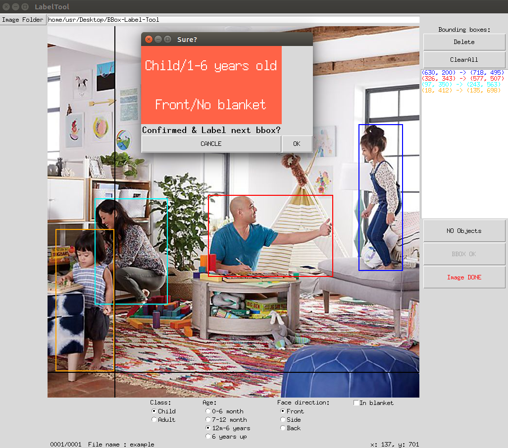

BBox-Label-Tool
===============

A simple tool for labeling object bounding boxes in images, implemented with Python Tkinter.

**Screenshot:**


Data Organization
-----------------
LabelTool  
|  
|--main.py   *# source code for the tool*  
|  
|--Images/   *# direcotry containing the images to be labeled*  
|  
|--Labels/   *# direcotry for the labeling results*  
|  
|--Examples/  *# direcotry for the example bboxes*  

Environment
----------
```console
foo@bar:~$ python3 --version
Python 3.6.5
foo@bar:~$ python3
>>> import PIL
>>> PIL.__version__
'4.2.1'
```

Run
-------
```console
foo@bar:~$ python3 main.py

```
Usage
-----
0. The current tool requires that :
   * The input `Image Folder`.
1. To create a new bounding box, left-click to select the first vertex. Moving the mouse to draw a rectangle, and left-click again to select the second vertex.
    - To delete a existing bounding box, select the coordinate from the listbox, and click `Delete`.
    - To delete all existing bounding boxes in the image, simply click `ClearAll`.
    - If no object appears in the image, click `NO Objects`

2. After drawing one bounding box, check all labels below. `Class`, `Age`, `Face direction` and `In blanket` or not.

3. Click `BBOX OK` if you finish labeling one bounding box.

4. After finishing one image, click `Image DONE` to advance.

5. Support multiple image formats: `"*.JPEG", "*.jpeg", "*JPG", "*.jpg", "*.PNG", "*.png", "*.BMP", "*.bmp"`.

Original  project address: [BBox-Label-Tool](https://github.com/puzzledqs/BBox-Label-Tool)


