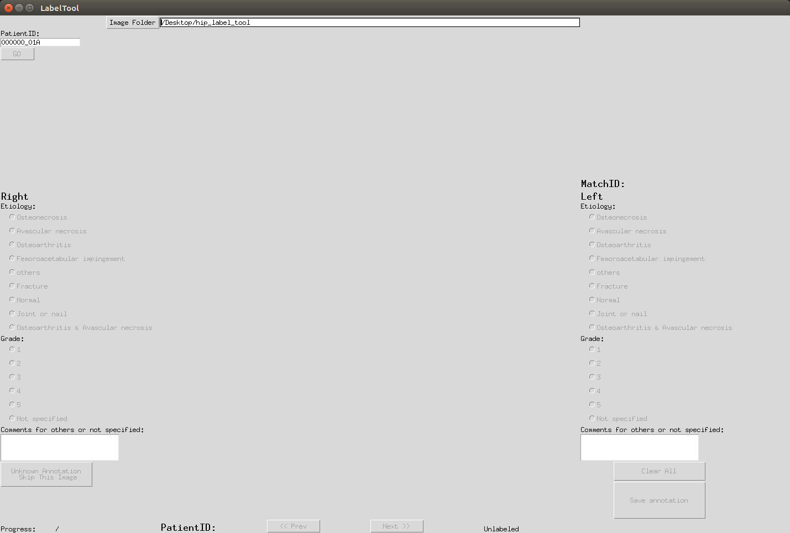
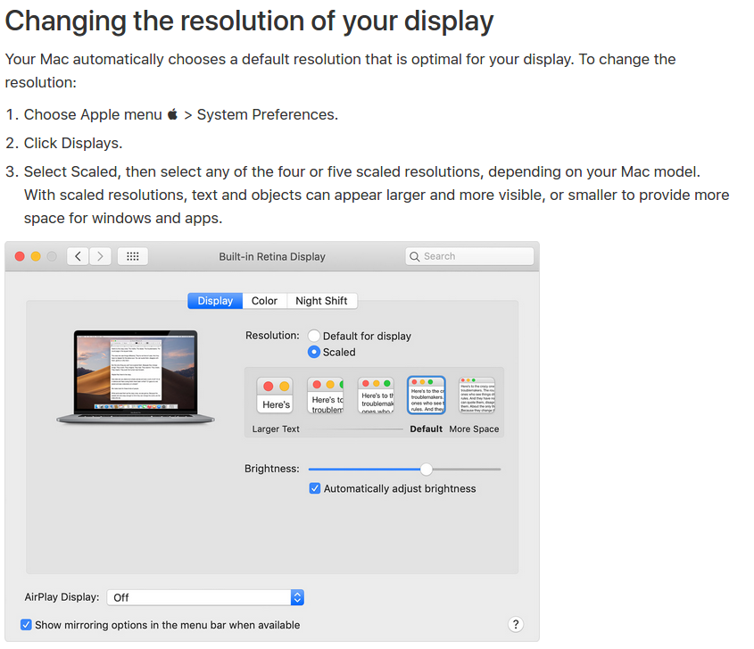

Hip-Label-Tool
===============

A tool for labeling etiology and grade of a hip, implemented with Python Tkinter.

Directory information
-----------------
```
hip_label_tool  
|  
├──label.py   
|  
├──DrLiao (your need to prepare this folder)
|    ├──HumanOA_Annotation_masterTable_Sort_0330_2020.xls
|    ├──original
|    ├──crop
|    ├──DrLiao_labels (deprecated, automatically generated after labeling)
|    └──DrLiao_labels_new (automatically generated after labeling)
|
├──DrLiao_export.csv  (automatically generated after labeling)
|     
├──README.md
|
├──installation.md 
|
└──src
```

Environment
----------
Please refer to installation.md


Setting
-----
1. ### **Data and directory:**
   * Delete `DrLiao` symbolic link and replace with your folder.
   * Make sure you have the same structure as above-mentioned directory.
   * If you are `DrX`, for example, rather than `DrLiao`. Please have:
        1. Change your folder name into `DrX`.
        2. Change `NAME = 'DrLiao'` in `label.py` (line 14) into `NAME = 'DrX'` and save.

2. Run
    ```console
    foo@bar:~$ python3 label.py
    ```
    then you can have the following GUI.
    

3. Adjust display resolution until you have the full view of the GUI.
    
    or check this out: https://support.apple.com/en-us/HT202471

Usage
-----
1. Run
    ```console
    foo@bar:~$ python3 label.py
    ```
2. Click `Image Folder` button and choose `DrLiao` folder.

3. Start labeling and feel free to leave the GUI anytime.

Labeling rules
-----
1. Need to write comments before skipping.
2. Need to write comments for the case whose eiology is others.
3. Need to specify grade for OA, Avascular necrosis or OA+Avascular necrosis cases.

Original  project address: [BBox-Label-Tool](https://github.com/puzzledqs/BBox-Label-Tool)


