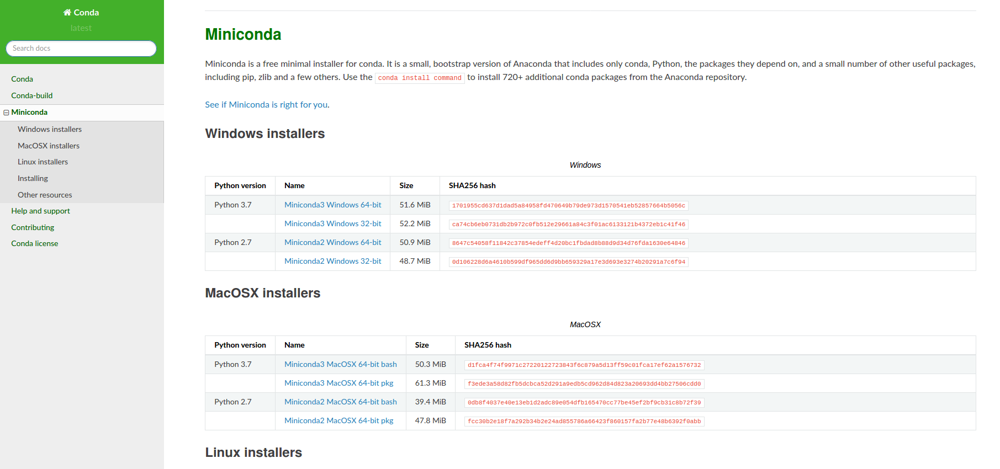

Installation requirement (For MacOSX)
===============
1. Miniconda:

    Download `Miniconda3 MacOSX 64-bit pkg` (Python 3.7 version) in `MacOSX installers` section and click to install.
    https://docs.conda.io/en/latest/miniconda.html
    

2. Use terminal to install the following 3 packages:
    ```
    conda install -c anaconda pillow

    conda install -c anaconda pandas

    conda install -c anaconda xlrd
    ```
    


